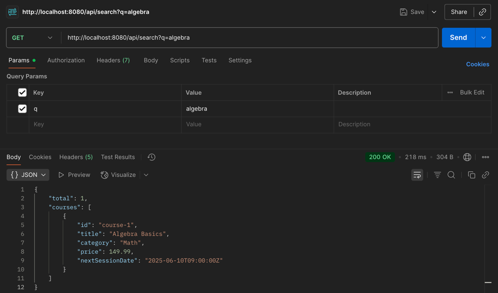
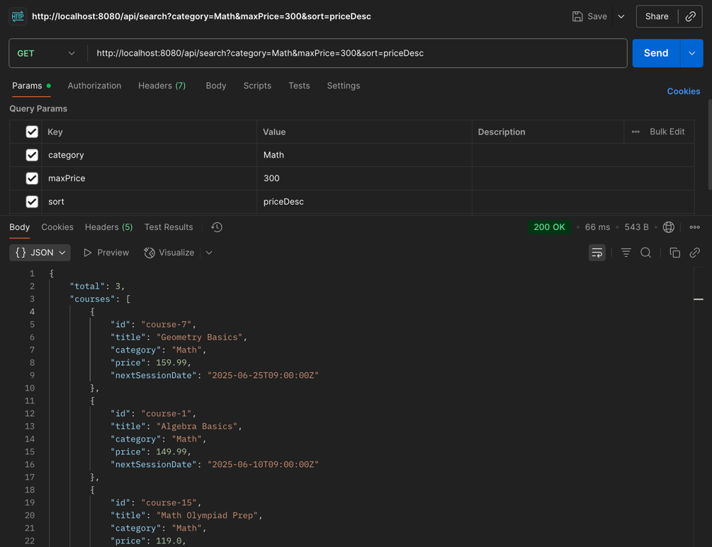
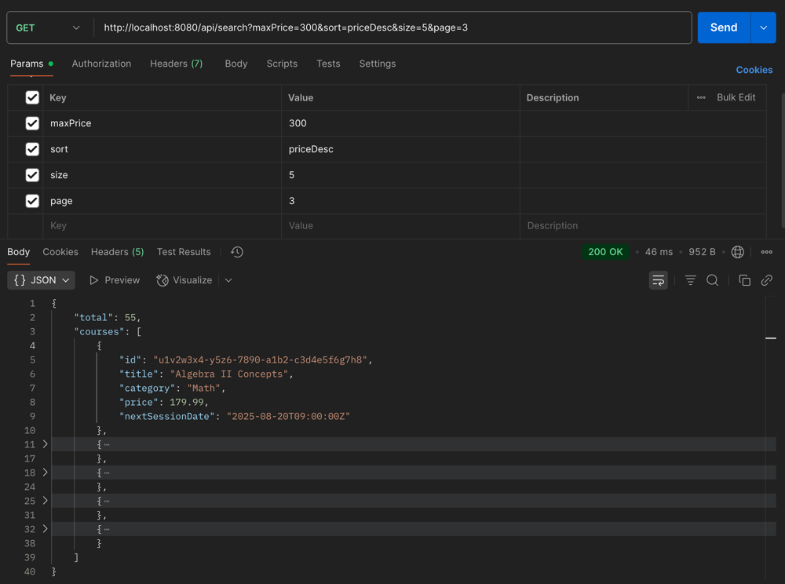
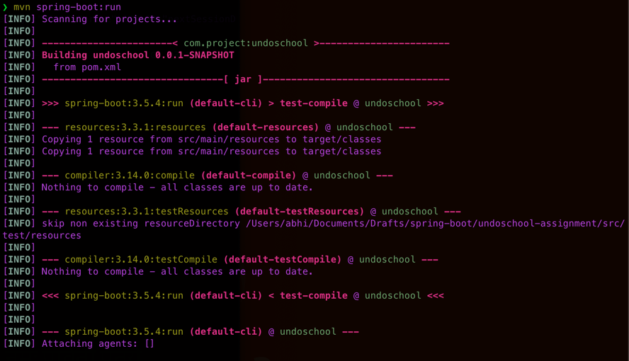
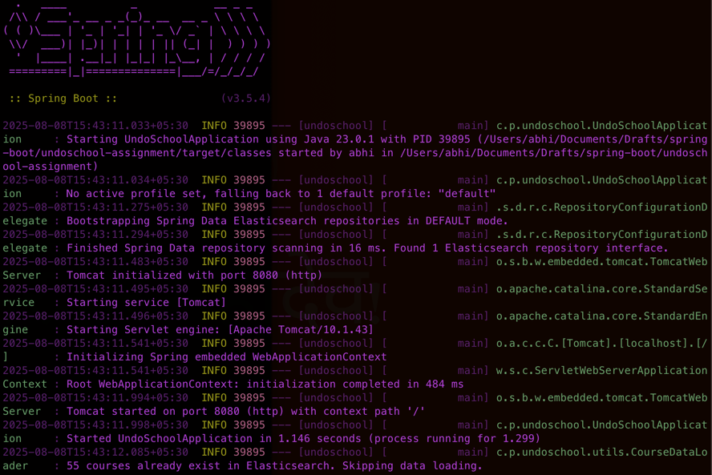
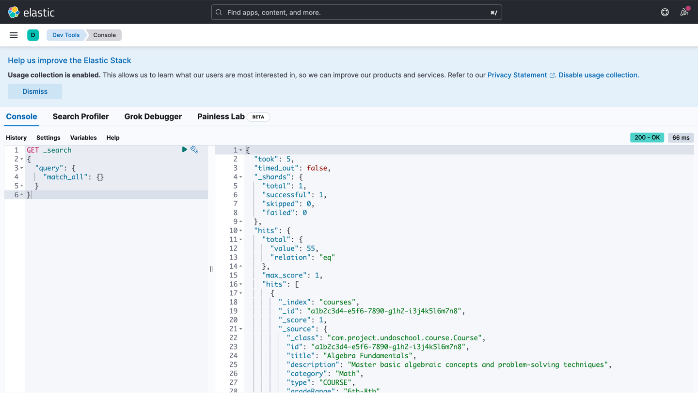

# Course Search API

A Spring Boot application with Elasticsearch integration for searching educational courses.

## Features

### Search Functionality

| Parameter   | Type     | Description                                                   | Example                           |
|-------------|----------|---------------------------------------------------------------|-----------------------------------|
| `q`         | String   | Full-text search query (searches in title and description)    | `?q=math`                         |
| `category`  | String[] | Filter by course category (exact match)                       | `?category=Math&category=Science` |
| `type`      | String[] | Filter by course type: `ONE_TIME`, `COURSE`, or `CLUB`        | `?type=COURSE&type=CLUB`          |
| `minAge`    | Integer  | Minimum age filter (inclusive)                                | `?minAge=10`                      |
| `maxAge`    | Integer  | Maximum age filter (inclusive)                                | `?maxAge=15`                      |
| `minPrice`  | Double   | Minimum price filter (inclusive)                              | `?minPrice=50`                    |
| `maxPrice`  | Double   | Maximum price filter (inclusive)                              | `?maxPrice=200`                   |
| `startDate` | ISO-8601 | Filter courses starting on or after this date                 | `?startDate=2025-07-01T00:00:00Z` |
| `sort`      | String   | Sort option: `upcoming` (default), `priceAsc`, or `priceDesc` | `?sort=priceAsc`                  |
| `page`      | Integer  | Page number (0-based, default: 0)                             | `?page=1`                         |
| `size`      | Integer  | Results per page (default: 10)                                | `?size=5`                         |

## Sample Requests

### Basic Search
```bash
curl "http://localhost:8080/api/search?q=algebra"
```


### Advanced Search
```bash
curl "http://localhost:8080/api/search?\
maxPrice=300&\
sort=priceDesc&\
page=3&\
size=5"
```


>Sample Request with `pageSize` and `pageNumber` (i.e. Here in this example, `pageSize=5` meaning 5 results in each page & `pageNumber=3` meaning third page)

>

## Response Format
```json
{
  "total": 42,
  "courses": [
    {
      "id": "course-1",
      "title": "Algebra Basics",
      "category": "Math",
      "price": 149.99,
      "nextSessionDate": "2025-06-10T09:00:00Z"
    }
  ]
}
```

## Setup

1. Start Elasticsearch and Kibana:
```bash
docker-compose up -d
```
> Note:- You can visit `http://localhost:5601/app/dev_tools#/console` to explore elastic data after running above command and verify data loaded by running below command

```curl
GET _search
{
  "query": {
    "match_all": {}
  }
}
```
2. Run the Spring Boot application:
```bash
mvn spring-boot:run
```
After you run this command you'll get below output in terminal



>This marks the application is running successfully!

The application will automatically:
- Create the Elasticsearch index

- Load sample courses from `src/main/resources/sample-courses.json`